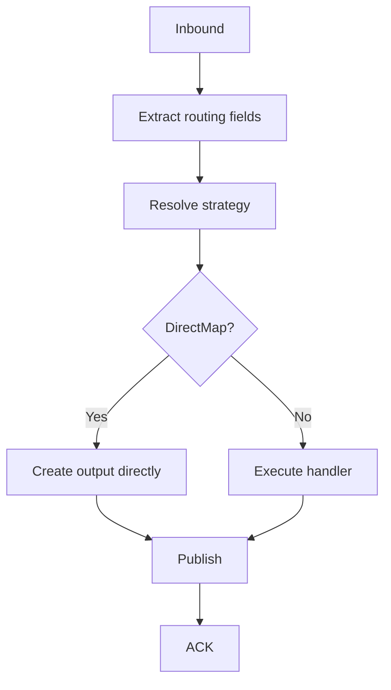
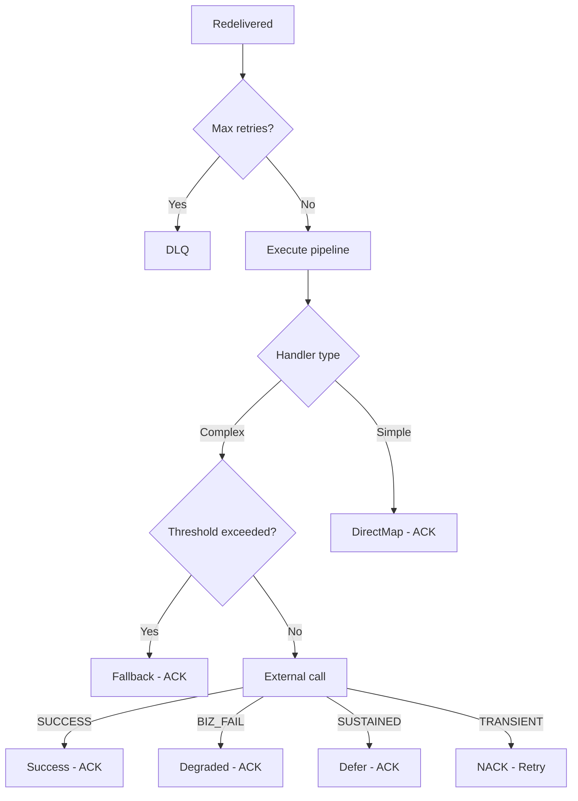

# {Feature Name} — Requirements & High-Level Design (L4)

| Field | Value |
| --- | --- |
| **Ticket** | {TICKET-ID} |
| **Service** | {service-name} |
| **Status** | Draft |
| **Author** | OCP Engineering |
| **Last Updated** | {YYYY-MM-DD} |

---

## Introduction

<!-- 
PURPOSE: Define what this document covers, the architectural context, and clear boundaries.
GUIDELINES:
- 2-3 paragraphs max
- State the service name and its responsibility
- Describe the processing model (event-driven, request-response, pipeline, etc.)
- Mention key design patterns (Strategy, Chain of Responsibility, CQRS, etc.)
- Describe relationship to other specs/features
- End with Scope Boundary (IN scope + OUT of scope with references)
-->

This document defines the requirements and high-level design for the {Feature Name} capability within the OCP {Service.Name} service. {Brief description of what the service does and its role in the platform}.

{Describe the processing model and key design patterns used.}

{Describe relationship to other features/specs — what it complements, depends on, or enables.}

**Scope Boundary:** {What is IN scope}. {What is OUT OF SCOPE — with references to where those concerns live}.

---

## Data Flow Diagrams

### High-Level Data Flow

```mermaid
flowchart LR
    subgraph Inbound[Inbound Systems]
        SRC1[{Source System 1}]
        SRC2[{Source System 2}]
    end

    subgraph Service[{Service Name}]
        API[{API Layer}]
        DB[({Persistence})]
        QUEUE[{Message Queue}]
        PROCESSOR[{Processing Component}]
        RETRY[{Retry Queue}]
        DLQ[{Dead Letter Queue}]
    end

    subgraph Outbound[Outbound Systems]
        TARGET1[{Target System 1}]
        TARGET2[{Target System 2}]
    end

    SRC1 -->|{protocol + action}| API
    SRC2 -->|{protocol + action}| API
    API -->|1. {step}| DB
    API -->|2. {step}| QUEUE
    QUEUE -->|3. Consume| PROCESSOR
    PROCESSOR -->|4. {step}| DB
    PROCESSOR -->|5. {step}| TARGET1
    PROCESSOR -->|6. {step}| TARGET2
    PROCESSOR -->|NACK on failure| RETRY
    RETRY -->|Retry with backoff| PROCESSOR
    RETRY -->|Max retries exceeded| DLQ
    PROCESSOR -->|7. ACK + cleanup| DB
```

### Processing Pipeline (per message/request)

```mermaid
flowchart TD
    A[{Initial trigger}] --> B[{Step 1}]
    B -->|{failure}| FAIL1[{Failure outcome}]
    B --> C[{Step 2}]
    C -->|{short-circuit}| SHORT1[{Short-circuit outcome}]
    C --> D[{Step 3}]
    D -->|{invalid}| FAIL2[{Rejection outcome}]
    D --> E[{Step 4}]
    E --> F{Requires external call?}
    F -->|No| G[{Simple output}]
    F -->|Yes| H[{Invoke external system}]
    H -->|SUCCESS| G
    H -->|BUSINESS_FAILURE| G2[{Degraded output}]
    H -->|SUSTAINED_OUTAGE| DEFER[{Defer}]
    H -->|TRANSIENT_FAILURE| NACK[{Retry}]
    NACK -->|Timeout reached| G2
    G --> I[{Publish result}]
    G2 --> I
    I -->|Publish failed| NACK2[{Retry}]
    I --> J[{ACK + Cleanup}]
```

### {Domain-Specific Mapping Diagram}

<!-- Optional: status-to-event mapping, channel routing, state machine, etc. -->

```mermaid
flowchart LR
    subgraph {Input Category}
        IN1[{Input 1}]
        IN2[{Input 2}]
    end

    subgraph {Output Category}
        OUT1[{Output 1}]
        OUT2[{Output 2}]
    end

    subgraph {Side Effects}
        SE1[{Side Effect 1}]
        SE2[None]
    end

    IN1 --> OUT1
    IN1 --> SE2
    IN2 --> OUT2
    IN2 --> SE1
```

### Migration Seam (if applicable)

<!-- Include ONLY if feature introduces a migration boundary -->

```mermaid
flowchart TD
    ENTRY[{Entry point}] --> PERSIST[{Shared step}]
    PERSIST --> CHECK{Routing condition?}
    CHECK -->|{New path}| NEW[{New behavior}]
    CHECK -->|{Legacy path}| LEGACY[{Existing behavior}]
```

---

## Glossary

| Term | Definition |
| --- | --- |
| **{Term}** | {Definition — what it is, what it does, its role in this feature.} |

---

## Requirements

<!-- 
GUIDELINES:
- Number sequentially: Requirement 1, 2, 3...
- One concern per requirement (atomic)
- User Story: As {role}, I want {goal}, so that {benefit}
- Acceptance Criteria: WHEN/THE + SHALL/MUST (normative)
- Cover: happy path, errors, idempotency, validation, config, security, observability
- Reference decisions: (DA-N), (DL-N)
- Typical categories (adapt as needed):
  1. Inbound processing
  2. Routing / Strategy
  3. Core business logic / State transitions
  4. Output / Event emission
  5. Idempotency
  6. External integration (with error handling)
  7. Migration / Compatibility
  8. Pipeline / Execution model
  9. Observability
  10. Extensibility
  11. Concurrency safety
  12. Resilience
-->

### Requirement 1: {Name}

**User Story:** As {role}, I want {goal}, so that {benefit}.

#### Acceptance Criteria

1. WHEN {condition}, THE {service} SHALL {behavior}
2. THE {service} SHALL {extract/validate/propagate}
3. IF {failure} → {handling behavior}

---

### Requirement 2: {Name}

**User Story:** {As role, I want goal, so that benefit.}

#### Acceptance Criteria

1. {Select/resolve by field}
2. {Each variant encapsulates: ...}
3. {No match → rejection behavior}
4. {New variants without modifying existing}

---

### Requirement N: {Name}

<!-- Add as many requirements as needed. See requirements-L4.md template for full category examples. -->

---

## High-Level Design

### Overview

* **{Architecture Option}** — {description}
* **{Retry/Resilience Option}** — {description}
* **Hexagonal Architecture** — consistent with {reference}
* **{Pattern}** — {description}
* **{Technology}** — {description}

### Hexagonal Architecture View

```mermaid
flowchart LR
    subgraph External_Left[External Systems - Inbound]
        EXT_IN[{Inbound System}]
    end

    subgraph Adapters_In[Adapters In]
        ADAPTER_IN[{Adapter - type}]
    end

    subgraph Application_Logic[Application Logic]
        CMD[{Command}]
        HANDLER[{Handler}]
        PIPE[{Pipeline Steps}]
        STATUS_H[{Status Handlers}]
    end

    subgraph Domain[Domain]
        STRATEGY[{Strategy}]
        SERVICES[{Domain Services}]
    end

    subgraph Ports_Out[Ports Out]
        PORTS[{Port Interfaces}]
    end

    subgraph Adapters_Out[Adapters Out]
        ADAPTS[{Adapter Implementations}]
    end

    subgraph External_Right[External Systems - Outbound]
        EXT_OUT[{Outbound Systems}]
    end

    EXT_IN --> ADAPTER_IN --> CMD --> HANDLER --> PIPE
    PIPE --> STRATEGY --> SERVICES
    PIPE --> STATUS_H --> PORTS --> ADAPTS --> EXT_OUT
```

### Queue Topology (if applicable)

```mermaid
flowchart LR
    PRODUCER[{Producer}] -->|Publish| MAIN[{Main Queue}]
    MAIN -->|Consume| CONSUMER[{Consumer}]
    CONSUMER -->|NACK| RETRY[{Retry Queue}]
    RETRY -->|DLX| MAIN
    CONSUMER -->|Max retries| DLQ[{DLQ}]
    CONSUMER -->|Defer condition| DEFER[{Deferral - black box}]
```

### Strategy Resolution Flow (if applicable)



### Retry and Exhaustion Flow (if applicable)



---

### Components and Interfaces

#### Adapters In

| Component | Type | Responsibility |
| --- | --- | --- |
| **{Name}** | {Type} | {One sentence} |

#### Application Logic

| Component | Type | Responsibility |
| --- | --- | --- |
| **{Command}** | CQRS Command | {What it carries} |
| **{Handler}** | Command Handler | {What it orchestrates} |
| **{Pipeline}** | Chain of Responsibility | {Steps in order. Short-circuit and threshold behaviors.} |
| **{Status Handler}** | IStatusHandler | {What it handles, what calls it makes, what results it returns.} |

#### Domain

| Component | Type | Responsibility |
| --- | --- | --- |
| **{Strategy}** | IChannelStrategy | {Routing logic. Pure rules, no port dependencies.} |
| **{Service}** | Domain Service | {Mapping/validation responsibility} |

#### Ports Out

| Port | Responsibility |
| --- | --- |
| **{IPort}** | {Operations exposed + return types} |

#### Adapters Out

| Adapter | Implements | External System | Key Behavior |
| --- | --- | --- | --- |
| **{Adapter}** | {IPort} | {System + protocol} | {Resilience, confirms, etc.} |

---

### Strategy Resolution Table (if applicable)

| {Field 1} | {Field 2} | Resolution | Handler / Output |
| --- | --- | --- | --- |
| {Value} | {Qualifier} | DirectMap | {Output type} |
| {Value} | {Qualifier} | UseHandler | {Handler class} |

---

### Error Handling

| Failure Point | Immediate Retry | Broker Retry | Exhaustion Outcome |
| --- | --- | --- | --- |
| {Persistence} unreachable | {N} fast retries | NACK | DLQ after max |
| {External} transient | {N} fast retries | NACK | {Fallback} after threshold |
| {External} sustained outage | No | No | Defer, ACK |
| {External} business failure | No | No | {Degraded}, ACK |
| {Publisher} failure | {N} fast retries | NACK | DLQ after max |
| Unrecognized input (poison) | No | No | Reject to DLQ |

**Constraint:** {handler threshold} < {general threshold}

---

### Key Design Decisions

| Decision | Choice | Rationale |
| --- | --- | --- |
| Architecture | {Option}: {description} | {Why} |
| Retry mechanism | {Option}: {description} | {Why} |
| Routing inputs | {Fields} | {Why} |
| External calls | {Pattern} | {Why} |
| State management | {Choice} | {Why} |
| Locking | {Choice} | {Why} |

---

### Technology Stack

| Layer | Technology |
| --- | --- |
| Runtime | {.NET version, hosting model} |
| CQRS | {Library} |
| Messaging | {Technology + client} |
| Database | {Technology} |
| Resilience | {Library} |
| Observability | {Logging, tracing, APM} |
| Infrastructure | {Container, orchestrator, cloud} |
| Architecture | {Patterns} |

---

## Open Questions

| # | Question | Impact | Owner |
| --- | --- | --- | --- |
| 1 | {Question} | {What's blocked} | {Owner} |

---

## References

* [{Requirements L4}]({url})
* [{Design L4}]({url})
* [{Solution Review}]({url})
* [{Architecture Reference}]({url})
